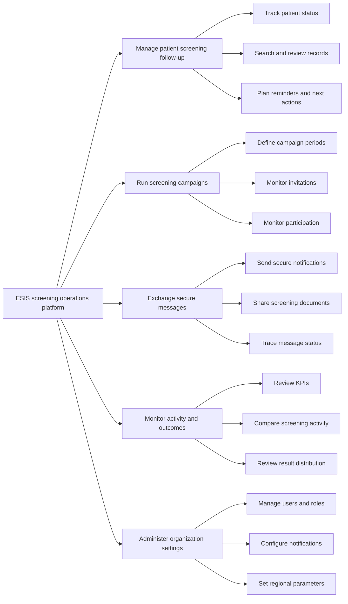
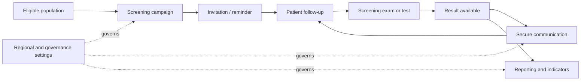
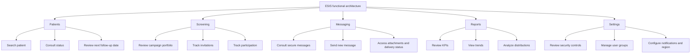
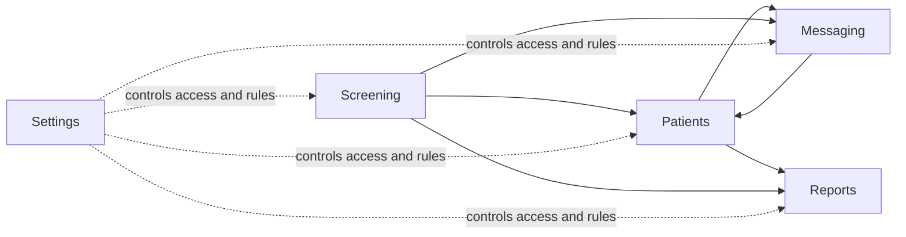
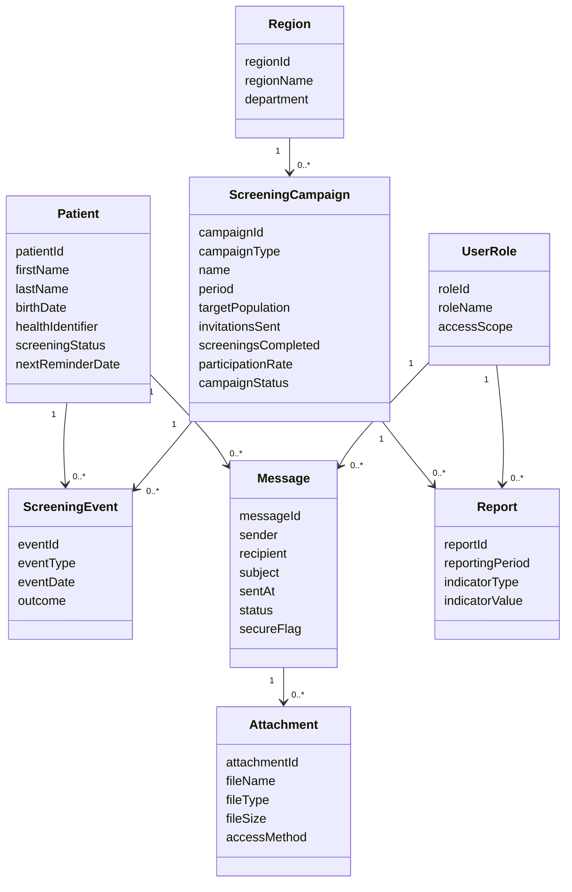
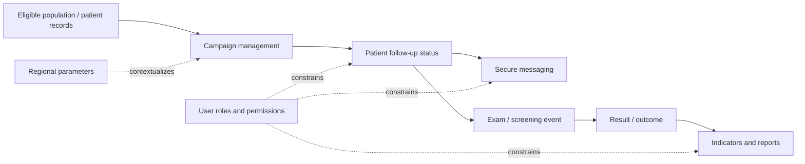

# ESIS Business, Functional and Data Architecture

## Summary

This document presents the current ESIS application architecture from a product perspective, not a technical implementation perspective.

It is based on the user-facing areas currently visible in the application:

- `patients`
- `screening`
- `messaging`
- `reports`
- `settings`

The goal is to describe:

- the business architecture: who uses the product and for what purpose
- the functional architecture: which business capabilities the app exposes
- the data architecture: which core business objects the workflows depend on

## Scope

In scope:

- internal healthcare screening workflows
- operational use by regional centers and healthcare professionals
- top-level functional domains visible in the app
- business objects implied by the current UI

Out of scope:

- front-end code structure
- libraries, frameworks, and deployment choices
- API design
- infrastructure and security implementation details

## Confirmed Facts

Confirmed from the current application screens and labels:

- the product is centered on cancer screening program operations
- the app includes patient management
- the app includes campaign/screening management
- the app includes secure messaging
- the app includes reports and indicators
- the app includes settings related to security, users, notifications, and regional configuration
- the app references regional screening organizations such as `CRDC`

## Assumptions

These points are inferred from the UI and should be validated with stakeholders:

- the primary users are clinicians, screening program coordinators, and administrative staff
- the product supports organized screening workflows rather than general clinical record management
- messaging is intended for sensitive health-related communication
- reporting is intended for operational steering and program performance monitoring
- settings are likely restricted to administrative or supervisory roles

## 1. Business Architecture

## Business Purpose

ESIS appears to support the operational management of organized cancer screening programs by helping teams:

- identify and follow eligible patients
- run and monitor screening campaigns
- communicate securely with patients or professionals
- track program performance and outcomes
- manage organizational and compliance-related settings

## Primary Business Actors

### Healthcare professional

Likely goals:

- consult patient screening status
- review results
- send or receive secure communications
- follow up on patient actions

### Screening coordinator / CRDC operator

Likely goals:

- monitor campaign execution
- track invitations and participation
- identify gaps in follow-up
- review regional performance indicators

### Administrative user

Likely goals:

- manage user access
- maintain regional configuration
- control notifications and operational settings

### System administrator

Likely goals:

- maintain security and compliance settings
- supervise access governance
- support operational traceability

## Business Capability Map

## Business Flow Overview

At a high level, the product seems to support this operating model:

1. A target population is managed within screening programs.
2. Campaigns drive invitations and follow-up actions.
3. Patient status changes as invitations, exams, and results progress.
4. Messaging supports secure communication around those events.
5. Reports consolidate operational performance and outcomes.
6. Settings control the organization and compliance context in which those workflows run.

## Business Risks

From a product perspective, the most important risks are:

- unclear ownership between clinical and administrative actions
- insufficient traceability of patient follow-up decisions
- mismatch between campaign metrics and patient-level statuses
- security/compliance expectations being visible in UI but not fully defined as business rules

## 2. Functional Architecture

## Functional Domains

The current app is organized into five top-level functional domains.

### Patients

Purpose:

- provide an operational patient list for screening follow-up

Observed capabilities:

- search for a patient
- view patient identity details
- view screening type
- view current status
- view upcoming reminder timing

### Screening

Purpose:

- manage and monitor screening campaigns

Observed capabilities:

- review active campaigns
- view target population counts
- view invitations sent
- view completed screenings
- review participation rate

### Messaging

Purpose:

- support secure communication tied to screening workflows

Observed capabilities:

- search messages
- review message status
- identify secure messages
- identify attached documents
- review secure access methods conceptually

### Reports

Purpose:

- support operational steering and performance review

Observed capabilities:

- review KPI cards
- filter by time period
- review screening activity trends
- review participation trends
- review result distribution

### Settings

Purpose:

- administer organizational and governance parameters

Observed capabilities:

- review security and compliance settings
- review user groups
- manage notifications
- configure regional context

## Functional Decomposition

## Functional Interaction Model

The domains are related rather than independent.

## Functional Notes

### Confirmed

- the product navigation is route-based around these five domains
- each domain is currently presented as a standalone working area

### Likely next functional needs

- explicit patient detail workflow
- explicit campaign creation and campaign closure rules
- structured follow-up actions and reminders
- role-based behavior differences between clinicians, coordinators, and administrators
- clearer handling for empty, error, and no-permission states

## 3. Data Architecture

## Core Business Entities

The current UI implies the following business entities.

### Patient

Observed attributes:

- identifier
- last name
- first name
- date of birth
- national identifier or equivalent health identifier
- screening type
- current status
- last visit
- next reminder date

### Screening campaign

Observed attributes:

- campaign identifier
- campaign type
- campaign name
- campaign period
- target population
- invitations sent
- screenings completed
- participation rate
- campaign status

### Message

Observed attributes:

- sender
- recipient
- subject
- content
- date and time
- status
- secure flag
- attachment metadata
- access method metadata

### Report / indicator set

Observed attributes:

- period
- activity KPIs
- participation metrics
- screening distribution by type
- result distribution

### User / role group

Observed attributes:

- user category
- permission level
- security/compliance posture
- regional affiliation

### Regional configuration

Observed attributes:

- region or CRDC
- department
- notification preferences
- security settings labels

## Conceptual Data Model

## Data Flow View

## Data Architecture Considerations

### Important business rules to define

- what uniquely identifies a patient across regions and workflows
- whether one patient can belong to multiple screening programs simultaneously
- how campaign membership is determined and refreshed
- which statuses are authoritative for patient follow-up
- whether messaging is patient-facing, professional-facing, or both
- how reporting aggregates align with patient- and event-level data

### Sensitive data areas

These data domains are likely sensitive and require explicit governance:

- patient identity data
- health-related screening results
- secure message content and attachments
- audit-relevant communication and follow-up status history
- user access and organizational scope

## Open Questions

The current UI is enough to define a draft architecture, but these questions remain open:

1. Who are the primary actors by route: clinician, coordinator, admin, or mixed?
2. Is `patients` intended to be the master workflow or only one operational view among several?
3. Are campaigns the driver of patient eligibility, or do patients exist independently and get attached to campaigns later?
4. What is the authoritative lifecycle for a screening case from invitation to result communication?
5. Does messaging target patients directly, healthcare professionals, or both?
6. Which reports are operational dashboards versus regulatory reporting outputs?
7. Which settings are global, regional, or role-specific?

## Recommended Next Documentation Artifacts

To make this architecture actionable, the next product documents should be:

- route-by-route functional specification
- role and permission matrix
- patient screening lifecycle definition
- campaign lifecycle definition
- data dictionary for core entities and statuses
- reporting KPI catalog with calculation rules

## Verification Approach

This document should be considered valid if stakeholders can confirm:

- the user groups are correct
- the five functional domains are the right top-level product structure
- the conceptual data entities match the business vocabulary
- the Mermaid diagrams reflect the intended operational model
- the open questions are either answered or explicitly deferred
